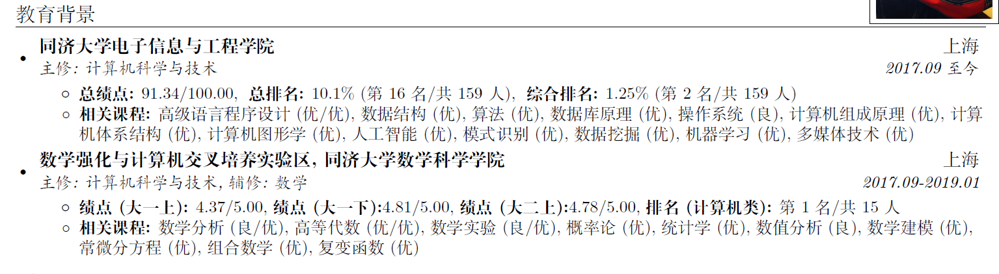
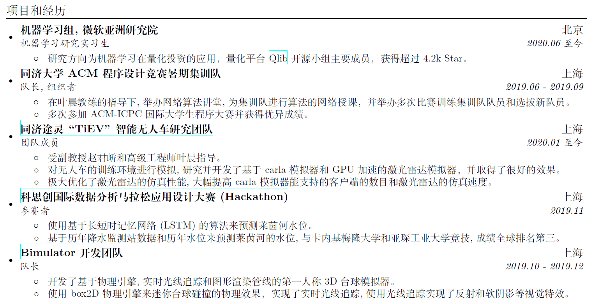
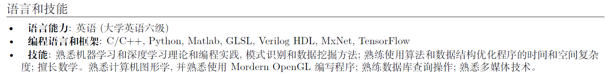
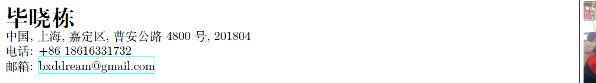

# 如何准备一份简历

## 1 概述

笔者大概是在疫情期间3月份左右开始准备简历的，之前一直没有一份属于自己的简历。有一天突然意识到自己到实习的时间了，与人让同学帮忙内推了字节跳动的机器学习岗。然后就两天时间迅速的准备了自己的简历（当时好仓促）。

后来也经历了大大小小的面试，简历也经过一次一次的迭代（然后页边距越变越窄才能勉强放在一页内）。

可见，迅速准备一份合格的简历是十分重要的（听说hr会对简历进行评估筛人啥啥啥的，不知道真不真）。

本章节以笔者自己某一版本的简历为例子，讲述了如何准备一份合格的简历。至于要做成属于自己的简历，就需要不断迭代不断琢磨啦。

## 2 简历分为哪几个部分

在我看来，一个本科生的简历有四个大部分即可，分别是

* 教育背景：讲述自己的学校专业
* 项目&实习经历：这里主要讲述自己做过的项目、加入过的实验室、或者参加过的实习等等
* 奖励：这里主要是获得某些ai大赛、建模比赛、编程大赛的奖励。如果感觉少可以把什么物理竞赛啥的都搬上来
* 技能：这里主要写自己掌握语言（包括英语和编程语言和框架），还有掌握的具体技能（前端or后端or人工智能等）

同时，简历还应该具备几个要素

* 个人照片（可以是证件照，也可以是生活照，但是最好是友善阳光的那种）
* 通讯地址
* 电话和邮箱

如果你说github大牛，你也可以把github的地址作为简历的一个要素

### 2.1 教育背景

因为笔者是某个不知名的交叉试验区出身，所以主修一门课辅修一门课，所以如何让第一眼看到简历的人立马了解这个试验区着实有点棘手，于是乎就写成了这个样子

* 

这里的教育背景主要是说明的前三个学期主修CS辅修数学的一个事实，至于同济大学特有的"数强实验班"被我叫成了**数学强化与计算机交叉培养实验区**，便于看到简历的人理解这个"数强实验班"是个啥

另外，我在里面还写了GPA和排名（当然实习也可以不写，夏令营还是建议写上）。然后我还加入了相关课程等内容（主要是看和实习的相关性，我面的都是偏AI和后端的，所以都写的后端和AI的课）

### 2.2 项目和经历

这部分如果有实习或者实验室经验是最好了，一般4个经历左右就好了，每个经历准确描述你的角色、工作即可。如果没有实验室和实习，写一些有趣的课堂项目也不错，但是要注意和你投递的岗位最好对口

### 2.3 奖励

这部分简单罗列有什么奖项就行，具体就不详细说了

### 2.4 技能

这部分主要包括英语六级，掌握的编程语言、掌握的具体技能。

比如说，你在计算机图形学这门课上认真做了作业和大项目并且却得不错的成绩，你可以说熟悉图形学相关知识，熟悉使用openGL图形管线进行渲染；如果你上过人工智能的课，你可以说熟悉机器学习理论和基础算法等等。

同时这部分最好有和公式对口的语言框架，比如说你是后端你可以写spring boot、hadoop啥的、你是AI你可以写pytorch啥的。这里还是要开你面的岗位要求你啥，如果你会你就写上。

我的某个版本是这么写的

## 3 关于语言

建议准备中英文简历各一份、不同公司对于简历的中英文要求各不相同，像是微软之类的外企可能两份简历都需要

## 4 关于其他要素

一些照片啥的，或者联系方式、通讯地址，集中写在一个地方比较好，比如开头

## 5 简历该不该夸大

我的观点是，没有必要可以的夸大自己的某项成果，但是也不要平铺直叙。如果在某个经历里真的担任的比较重要的角色就写的比较重要一点。

同时，一些共同奖项或者任务，即使自己没有担任主要角色，也没有必要可以解释自己没做什么，简单陈述实时即可。

## 6 关于简历模板

本目录下有一个project的文件夹，可以通过latex进行编译（编译结果就算CV.pdf）。读者可以以此为参照进行修改形成自己初步的简历，然后不断迭代形成自己的独特风格

